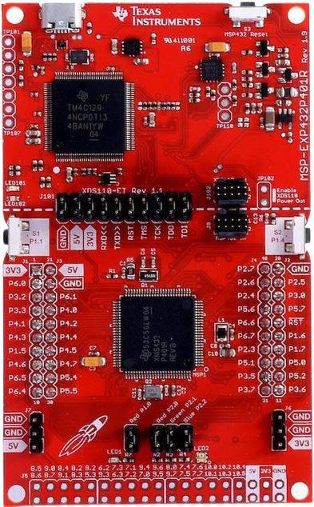
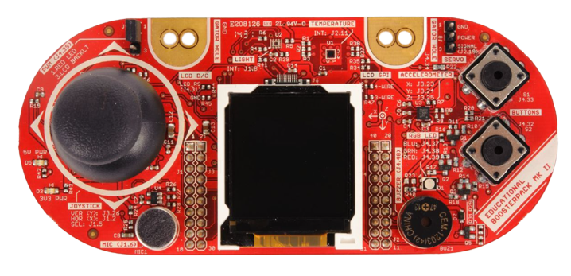

# M.I.M.E.H Project for Embedded Software for the Internet of Things

---

  |    |    |    |    |    


--- 

***Assoc. prof. <a href="https://webapps.unitn.it/du/it/Persona/PER0212812/Didattica">Yildrim Kasim Sinan</a>***

**Group 10**: ***<u>De Marco Matthew</u>***, ***<u>Lo Iacono Andrea</u>***, ***<u>Pezzo Andrea</u>*** 

> [!NOTE]\
> To view this file in preview mode, open it in a text editor like Visual Studio Code, Atom, or an online Markdown viewer such as [Dillinger](https://dillinger.io/). Otherwise, if the project is opened in your compiler, such as PyCharm, the preview will be displayed automatically.

<div align="center">

</div>

<div align="justify">

<details>
<summary><h2>Table of Contents 📖</h2></summary>

- [M.I.M.E.H Project for Embedded Software for the Internet of Things](#mimeh-project-for-embedded-software-for-the-internet-of-things)
  - [Table of Contents](table-of-contents)
  - [Idea of the project](#idea-of-the-project-)
  - [Requirements](#requirements-)
    - [Hardware Requirements](#hardware-requirements-)
    - [Software Requirements](#software-requirements-)
      - [Setting Up Python](#setting-up-python-)
      - [Libraries Python](#libraries-python-)
      - [Library Installation](#library-installation-)
  - [Getting Started](#getting-started-)
    - [Setting up the Hand](#setting-up-the-hand-)
    - [Setting up Wiring](#setting-up-wiring-)
    - [Setting up Arduino-Texas Instrument Communication](#setting-up-arduino-texas-instrument-communication-)
    - [Setting up the Arduino Software](#setting-up-the-arduino-software-)
      - [Project Layout](#project-layout-)
      - [How It Works](#how-it-works-)
      - [Usage](#usage-)
    - [Setting up the Texas Instrument](#setting-up-the-texas-instrument-)
      - [Project Layout](#project-layout--1)
      - [How It Works](#how-it-works--1)
      - [Usage](#usage--1)
    - [Setting up your personal computer and the Python Code](#setting-up-you-personal-computer-and-the-python-code-)
      - [Project Layout](#project-layout--2)
      - [How It Works](#how-it-works--2)
      - [Usage](#usage--2)
  - [User guide](#user-guide-)
  - [Link to the Youtube video and the Presentation](#link-to-the-youtube-video-and-the-presentation-)
  - [Team Members and Contributions](#team-members-and-contributions-)
  - [Acknowledgments](#acknowledgments-)
  - [License](#license-)

</details>


<!--=========================================================================-->


## Idea of the project 💡

---
<!--=========================================================================-->

The main idea of the project is to build a robotic hand, which moves using a dedicated servomotor for each finger.
The hand structure is composed of 3D-printed components, while movement is controlled through two different modes.
The first uses the mediapipe library OpenCV to track the movements of the user fingers, captured by the computer webcam.
The Manual Control Mode is used to move the fingers, singularly changing the angle value of the related servomotor using input joysticks.
Mode selection is controlled by a Texas Instrument board, which displays a menu on its integrated display. It's possible to move within the menu using the joystick and button sensors.
The Texas Instruments board send the inputs for the Arduino board which selects and moves the servomotors accordingly.


## Requirements 📋

---
<!--=========================================================================-->

### Hardware Requirements 🔧

- <u>**Texas Instrument Board MSP432**</u>
- <u>**Texas Instrument BOOSTXL-EDUMKII Educational BoosterPack™ Plug-in Module Mark II**</u>
- <u>**Arduino UNO R4 Minima**</u> Board
- <u>**Logical Level Shifter**</u>
- Full set of cables (male-to-male, male-to-female)
- 5x <u>**Servomotors**</u>
- 1x <u>**Breadborad**</u>

<div style="display: flex; justify-content: space-between; align-items: center;">
    
    
    
    

</div>

### Software Requirements 💻

- [Arduino IDE](https://www.arduino.cc/en/software)
- [Code Composer Studio](https://www.ti.com/tool/download/CCSTUDIO/12.7.0)
- Python IDE (e.g. [PyCharm](https://www.ti.com/tool/download/CCSTUDIO/12.7.0)) 

#### Setting Up Python 🐍

To run this project, you need to have Python installed along with the required dependencies.
Ensure you have Python **3.8+** installed. You can download it from the official Python website:
[Download Python](https://www.python.org/downloads/)
After installation, verify the installation by running:
```sh
python --version
```
or, on some systems:
```sh
python3 --version
```

#### Libraries Python 📚

For optimal program performance, it is recommended to use a machine with a dedicated and powerful graphic card. However, the program can also run on less powerful systems. The required libraries are:

- `cv2`
- `mediapipe`
- `importlib`
- `os`
- `tkinter`
- `POL`
- `sys`
- `time`
- `math`
- `collections`
- `pydantic`
- `numpy`
- `pyserial`
- `threading`

#### Library Installation ⚙️

It is recommended to install all these libraries before running the program to avoid errors during runtime. Below are the commands to install the libraries via `pip`:

```bash
pip install opencv-python
pip install mediapipe
pip install importlib-metadata
pip install python-os
pip install tk
pip install python-polling
pip install sys
pip install math
pip install collections
pip install pydantic
pip install numpy
pip install pyserial
pip install threading
```

## Getting Started 🚀

---

<!--=========================================================================-->

### Setting up the Hand ✋

The project begins with the construction of the hand components, which are ***3D-printed using PLA material***. Some parts require *milling to reduce friction* between the joints of the phalanges, ***improving overall movement performance***.  
The components are assembled using **screws and hot glue**:  
- **Screws** are primarily used to connect the phalanges.  
- **Hot glue** secures other parts, such as the forearm and the springs.  

Finger movement is achieved through a combination of ***springs and fishing line***:  
- The **springs** provide a constant force that helps return the fingers to their default position.  
- The **fishing line** connects the fingers to the servomotors, ***transmitting motion from the servos to the fingers***.

### Setting up Wiring 🔌

---

The wiring process starts by connecting the **servomotors** to the **Arduino board** through a breadboard.  
Each servo operates with **three wires**:  
- **Two wires for power** (*GND and 5V*).  
- **One wire for the signal**.  

To supply power:  
- Connect the breadboard to the Arduino board using **male-to-male wires**, linking the ***GND and 5V pins*** (*since the servos require 5V*).  
- Finally, connect the ***signal wires to the digital pins of the Arduino board***, allowing for individual control of each motor.


### Setting up Arduino-Texas Instrument Communication 🔄

---


The wiring for **Arduino-Texas Instrument communication** begins by connecting a ***logical level shifter*** to the breadboard.  
This component is **essential** for transmitting signals between boards ***operating at different voltage levels***:  
- ***Texas Instrument works at 3.3V.***  
- ***Arduino operates at 5V.***

1. **🛠️ Powering the Breadboard**
    - **Connect the 5V output from Arduino** to one of the breadboard's power rails.  
    - **Connect the 3.3V output from Texas Instrument** to a separate power rail.  
    - ***Ensure both devices share a common ground (GND)*** on the breadboard.  

2. **🔌 Connecting the Logical Level Shifter**
   - **LV3 pin** → *Connect to pin 3.2 of the Texas Instrument.*  
   - **GND pins** → ***Connect both to the 3.3V and 5V sides of the level shifter.***  
   - **LV (Low Voltage) pin** → *Connect to 3.3V (power from Texas Instrument).*  
   - **HV4 pin** → ***Connect to pin 1 of the Arduino.***  
   - **HV (High Voltage) pin** → *Connect to 5V (power from Arduino).*  
   - **Pin 0 of the Arduino** → ***Connect to pin 2.3 of the Texas Instrument.***  

This setup ***ensures correct signal voltage conversion***, allowing **reliable communication between the two boards** ***without risking damage due to voltage mismatches.***

### Setting up the Arduino Software 🔨

---

To ensure proper functionality of the robotic hand, follow these steps to set up Arduino IDE and configure the necessary dependencies:

1. ***Install Arduino IDE***
   - Download and install the latest version of Arduino IDE from the official website: [Arduino Download](https://www.arduino.cc/en/software).
   - Connect your Arduino board to the computer using a USB cable.
2. ***Install the Servo Library***
   This project requires the Servo library to control the servomotors.
   - Open Arduino IDE and go to *Sketch → Include Library → Manage Libraries*.
   - In the Library Manager, search for *"Servo"*.
   - Select the Arduino Servo Library and click Install.
3. ***Select the Correct Board and Port***
   - Navigate to Tools → Board and select the correct Arduino model (e.g., *Arduino Uno*, *Mega*, etc.).
   - Go to *Tools → Port* and **select the COM port associated with your Arduino board**.
4. ***Upload the Firmware***
   - Open the Arduino project file (*.ino*).
   - Verify the code by clicking the *Verify (Check) button*.
   - Upload it to the board by clicking the *(Upload) button*.
5. ***Check Serial Communication***
   - Open **Serial Monitor** (*Tools → Serial Monitor*) and set the baud rate to match the one in your code (e.g., *9600*).
   - Ensure that the board receives and sends signals correctly.

#### Project Layout 📂
```
ArduinoCodeForMIMEH/
└── ArduinoCodeForMIMEH.ino    # Main Arduino sketch for controlling the robotic hand
```
* **`ArduinoCodeForMIMEH.ino`**: The main Arduino sketch responsible for receiving commands (e.g., from the MSP432 or a Python script) and controlling the servos accordingly.
  * Initializes serial communication with external devices (such as an MSP432 or a computer).
  * Reads incoming commands and translates them into servo motor movements.
  * Sends feedback data to the main system, confirming the executed gestures.
  * Implements basic error handling to detect connection or movement issues.

#### How It Works ⚡

1. **Receiving Commands:**
    * The Arduino listens for gesture commands from the MSP432 or a connected Python script.  
2. **Servo Control:**
    * Based on the received gesture, the Arduino moves the servos to predefined positions.  
3. **Feedback and Error Handling:**
    * The Arduino sends confirmation messages back to the MSP432 to ensure proper execution.

#### Usage 🎮

1. **Hardware connection:**
    Connect the **Arduino R4 UNO MINIMA** to your computer via USB.
2. **Select and open correct file:**
    Open `ArduinoCodeForMIMEH.ino` in the Arduino IDE.
3. **Check the connections:**
    In the Arduino IDE, be sure to select the correct board and port.
4. **Upload the code to the Arduino**
5. **Observe the servo movements based on detected gestures**


### Setting up the Texas Instrument 🎛️

---

To ensure the proper functionality of the Texas Instruments board, follow these steps to configure Code Composer Studio (CCS) with the required libraries.

1. **Configure Driver Lib**
   1. Download the ***Driver Lib Folder*** file. 
   2. Open CSS and left click on Project Folder to select Properties.
   3. Select CSS Build.
   4. Click ARM Compiler and then Include Options.
      1. Add *"simplelink_msp432p4_sdk_3_40_01_02/source"* directory to "Add dir to #include search path" window.   
   5. Click ARM Linker and File Search Path.
      1. Add *"simplelink_msp432p4_sdk_3_40_01_02/source/ti/devices/msp432p4xx/driverlib/ccs/msp432p4xx_driverlib.lib"* to "Include library file..." window.
   6. Click Apply and Close to save the changes.
2. **Configure GRLIB Library**
   1. Download the ***GRLIB Library*** file. 
   2. Open CSS and left click on Project Folder to select Properties.
   3. Select CSS Build.
   5. Click ARM Linker and File Search Path.
      1. Add *"simplelink_msp432p4_sdk_3_40_01_02/source/ti/grlib/lib/ccs/m4/grlib.a"* to "Include library file..." window.
   6. Click Apply and Close to save the changes.
3. **Build and Upload the Code**
   - Click *Build* (*Project → Build Project*).
   - Ensure there are no compilation errors.
   - <u>Upload</u> the compiled program to the **Texas Instruments board**.

<div align="center">
  
</div>

<div align="center">
  
</div>

#### Project Layout 📂
```
MSP Code/
└── RoboticHand/                          # Contains embedded code for MSP microcontroller
    └── RoboticHand/                      # Main project folder
        ├── main.c                        # Main entry point for the MSP432 firmware
        ├── startup_msp432p401r_ccs.c     # Startup code for MSP432
        ├── StateMachine.h                # Defines state machine logic
        ├── system_msp432p401r.c          # System initialization for MSP432
        ├── Communication/                 # Handles UART-based communication
        │   ├── uartCommunication.c        # Implements UART communication functions
        │   └── uartCommunication.h        # Header file for UART functions
        ├── LcdDriver/                     # Driver for interfacing with an LCD
        │   ├── Crystalfontz128x128_ST7735.c  # Low-level driver for Crystalfontz 128x128 LCD
        │   ├── Crystalfontz128x128_ST7735.h  # Header file for LCD driver
        │   ├── HAL_MSP_EXP432P401R_Crystalfontz128x128_ST7735.c  # Hardware abstraction for LCD
        │   └── HAL_MSP_EXP432P401R_Crystalfontz128x128_ST7735.h  # Header for HAL functions
        └── Model/                         # Implements system modeling for gesture control
            ├── model.c                     # Contains mathematical models for hand movements
            └── model.h                     # Header file for model functions
```
* **`RoboticHand/`**: This directory contains all firmware files related to the MSP432 microcontroller, responsible for interpreting hand gestures and controlling servos accordingly.
  * **`main.c`**: The main program for the MSP432. Initializes the system, handles input from the hand detection algorithm, and processes gesture commands.
  * **`startup_msp432p401r_ccs.c`**: Contains startup routines for the MSP432, including low-level hardware initialization.
  * **`StateMachine.h`**: Implements a finite state machine that determines the hand's gesture state based on sensor input.
  * **`system_msp432p401r.c`**: Configures the system clock, timers, and other essential peripherals for real-time gesture processing.
  * **`Communication/`**: This module handles UART-based communication, enabling data exchange between the MSP432 and external devices (e.g., a PC or Arduino).  
    * `uartCommunication.c`: Implements functions for configuring and using the UART (Universal Asynchronous Receiver-Transmitter)
      * Sets up baud rate, data frame format, and interrupt handling
      * Provides functions for sending and receiving data via UART.
    * `uartCommunication.h`: Header file containing function prototypes and UART configuration macros.  
  * **`LcdDriver/`**: This module manages the interface with a Crystalfontz 128x128 LCD screen, displaying system status and feedback messages.
    * `Crystalfontz128x128_ST7735.c`: Implements functions for initializing and controlling the LCD.
    * `Crystalfontz128x128_ST7735.h`: Header file defining constants and function prototypes for the LCD driver.
    * `HAL_MSP_EXP432P401R_Crystalfontz128x128_ST7735.c`: Provides a hardware abstraction layer (HAL) for MSP432 to communicate with the LCD.
    * `HAL_MSP_EXP432P401R_Crystalfontz128x128_ST7735.h`: Header file defining HAL functions and structures.
  * **`Model/`**: This module implements mathematical models and logic for gesture recognition and movement control.
    * `model.c`: Implements the hand movement model using predefined angles and calculations.
      * Processes sensor input to refine gesture detection.
      * Converts raw data into actionable servo commands.
    * `model.h`: Header file containing model function prototypes and constants.

#### How It Works ⚡

1. **Initialization:**
    * The `main.c` file initializes the MSP432 system, setting up timers, GPIO pins, and communication interfaces.
    * The startup file `startup_msp432p401r_ccs.c` ensures that all system components are correctly configured.  
2. **Gesture Processing:**
    * The **StateMachine** (in `StateMachine.h`) processes hand position data and determines the appropriate servo commands.  
    * The **Mode** component processes raw data and refines gesture detection.  
3. **Communication:**
    * The **Communication** module manages UART communication with external systems.
4. **LCD Display:**
    * The **LcdDriver** updates the LCD screen to show system status.

#### Usage 🎮

1. **Compile and upload the firmware:**
    Compile and upload the **MSP432 firmware** (inside `MSP Code/RoboticHand/`) using **Code Composer Studio (CCS)**.
2. **Check connections and power supply:**
    Ensure the MSP432 is powered and connected to the Arduino and other components.
3. **Run the program:**
    Run the program and monitor serial output for system messages.

### Setting up you personal computer and the Python Code 🖥️

---

#### Project Layout 📂

```
Python Code/  
├── Assets/             # Contains logos and images  
│   └── Logos/  
│       └── mini_logo.jpg  
├── Arduino/            # Contains Arduino code  
│   └── controller.py   # Manages serial communication with Arduino  
├── Dynamics/           # Contains logic for hand management  
│   └── hand.py         # Defines the `Hand` class for landmark detection  
├── Processing/         # Contains modules for video processing  
│   └── video_processing.py  # Manages the video stream processing  
├── Recording/          # Contains modules for video recording  
│   └── rec.py          # Defines the `FoulRecorder` class for signal recording  
├── signal_detection/   # Contains modules for specific signal detection  
│   └── peace.py        # Example of "peace" signal detection  
├── main.py             # Main file to execute the program  
└── requirements.txt    # List of Python dependencies  
```

* **`Assets/`**: Contains resources like logos and images used in the graphical interface.  
* **`Arduino/`**: Contains scripts and code for communication with the Arduino board.  
    * `controller.py`: Manages serial communication with Arduino to send commands to the servos. Includes functions to initialize serial communication, send generic commands, and set servo angles.  
* **`Dynamics/`**: Contains the logic for managing and calculating the dynamics of the hand.  
    * `hand.py`: Defines the `Hand` class, which receives hand landmark points from MediaPipe and calculates the necessary angles to control the servos. Also includes functions to determine if the hand is open, closed, or in specific positions.  
* **`Processing/`**: Contains scripts for processing the video stream.  
    * `video_processing.py`: Contains the `process_video` function which handles video stream acquisition from a webcam or file, detects hands using MediaPipe, and calls signal detection functions.  
* **`Recording/`**: Contains scripts for recording videos of detected signals.  
    * `rec.py`: Defines the `FoulRecorder` class, which handles video recording of detected signals. It allows starting, stopping, and saving recordings, keeping a buffer of recent frames.  
* **`signal_detection/`**: Contains scripts for detecting specific signals.  
    * `peace.py`: Contains the `peace` function, which detects the "peace" gesture (two fingers up) and starts/stops the corresponding video recording.  
* **`main.py`**: The main file to execute the graphical interface and start the detection process.  
* **`requirements.txt`**: List of Python libraries required to run the project.

#### How It Works ⚡

1. **Initialization:**
    * The `main.py` program starts the graphical interface and attempts to connect to Arduino through the specified serial port.  
    * A separate thread is started to listen for commands from Arduino.  
2. **Video Detection:**
    * The `process_video` function in `video_processing.py` acquires the video stream from the webcam or a file.  
    * MediaPipe detects hands in the video stream and provides landmark points.  
3. **Gesture Processing:**
    * The `Hand` class in `hand.py` uses the landmarks to calculate finger angles and determine the hand's position.  
    * Functions in the `signal_detection` package (e.g., `peace.py`) use the information from the `Hand` class to detect specific gestures.  
4. **Arduino Control:**
    * The `set_servo_angles` function in `controller.py` sends commands to Arduino to control the servos based on the detected gestures. 
5. **Video Recording:**
    * The `FoulRecorder` class in `rec.py` records videos of detected gestures, categorizing them by signal type.  
6. **Interaction with Arduino:**
    * The program is designed to receive commands from Arduino, such as starting video processing or updating the displayed status in the interface.  
    * Arduino sends the command "1" to start video processing and "2" to update the status label.

#### Usage 🎮

1. **Run the `main.py` file:**
    ```bash
    python main.py
    ```
2. **Interact with the graphical interface:**
    The interface displays the system status and any messages.
3. **Position your hand in front of the webcam:**
    Ensure that the hand is clearly visible.
4. **Perform supported gestures:**
    The system will detect the gestures and control the robotic hand.
5. **Check video recordings:**
    The videos of the detected gestures will be saved in the `Recording` folder.

## User guide 📑

---

<!--=========================================================================-->

The **robotic hand** operates in ***two different modes***, which can be selected using the **Texas Instruments board**. Follow the steps below to use each mode:

1. ***Hand Tracking Mode (Mediapipe)***

   This mode allows the robotic hand to replicate the user's finger movements in real time using MediaPipe and a computer webcam.
     Steps:
      1. **Connect** the *Texas Instruments board* and the *Arduino board* to the computer.
      2. Open *PyCharm* (or ur *Python IDE*) and run the `main.py` file:
              ```
              python main.py
              ```
      3. The script *establishes a serial communication* with the *Arduino*.
      4. The MediaPipe library tracks the user’s hand movements through the webcam.
      5. The robotic hand mimics the movements detected by MediaPipe.
     
2. ***Manual Control Mode (Joystick):***

   This mode allows for *individual finger control using the joystick* on the *Texas Instruments board*.
     Steps:
      1. Select the *Manual Control Mode* from the menu on the *Texas Instruments board*.
      2. *Use the joystick* to navigate through the menu and *select the finger to move*.
      3. Adjust the joystick position to change the angle of the selected finger.
      4. To **exit** this mode, perform a *left shift with the joystick*.
      5. Once a mode is selected, the *Texas Instruments board* sends the commands to the *Arduino*, which then controls the servomotors accordingly.

## Link to the Youtube video and the Presentation 🎥

---

<!--=========================================================================-->
- [YouTube Video](https://youtu.be/Hg43R4kENIY)
- [Presentation-PDF](https://github.com/MattDema/EmbeddedIoT_MIMEH/blob/0507d463df15e79ee8f209244c31c05f9a32046a/Assets/MIMEH%20-%20Presentation/MIMEH%20-%20Embedded%20Sfotware%20for%20the%20Internet%20of%20Things%20Project%20-%20De%20Marco%20Matthew%2C%20Lo%20Iacono%20Andrea%2C%20Pezzo%20Andrea.pdf)

## Team Members and Contributions 🧑‍🤝‍🧑

---

<!--=========================================================================-->
The project was a collaborative effort, with development divided into distinct areas: hand modeling and construction, Python Programming, Arduino programming, and Texas Instruments platform integration.

- [Matthew De Marco](https://github.com/MattDema) ([matthew.demarco@studenti.unitn.it](matthew.demarco@studenti.unitn.it))
  - Contributed to the Texas Instruments program by developing the operating menu and integrating Python configuration with the Texas Instruments system.
- [Andrea Lo Iacono](https://github.com/ADreLOI) ([andrea.loiacono@studenti.unitn.it](andrea.loiacono@studenti.unitn.it))
  - Developed Python code and Python-Arduino integration.
  - Remodeled 3D files for printing hand components and worked on hand construction.
- [Andrea Pezzo](https://github.com/AndreaP2203) ([andrea.pezzo-1@studenti.unitn.it](andrea.pezzo-1@studenti.unitn.it))
  - Contributed to hand construction and Arduino implementation.
  - Assisted in both the Arduino implementation and Texas Instruments development.

## Acknowledgments 🙌

---

<!--=========================================================================-->
**Embedded Software for the Internet of Things Course** - ***Professor: <a href="https://webapps.unitn.it/du/it/Persona/PER0212812/Didattica">Yildrim Kasim Sinan</a>***

<div style="display: flex; justify-content: space-between; align-items: center;">
    <a href="https://fablab.unitn.it/" target="_blank">
        
    </a>
    <a href="https://www.inmoov.fr" target="_blank">
        
    </a>
</div>

## License 📜

---

This project is licensed under the MIT License - see the [LICENSE](LICENSE.txt) file for details.

---

<p align="center">
  <a href="#mimeh-project-for-embedded-software-for-the-internet-of-things" style="text-decoration: none;">
    
    <br>
    <strong>Back to Top</strong>
  </a>
</p>

---

</div>
